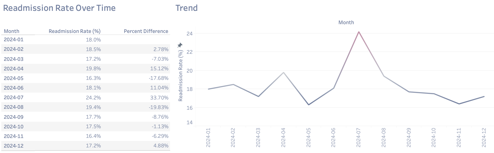
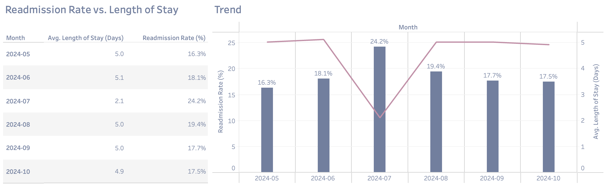
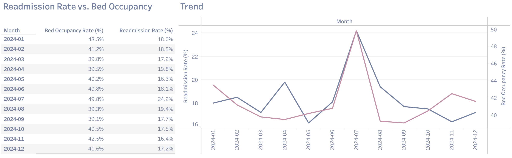
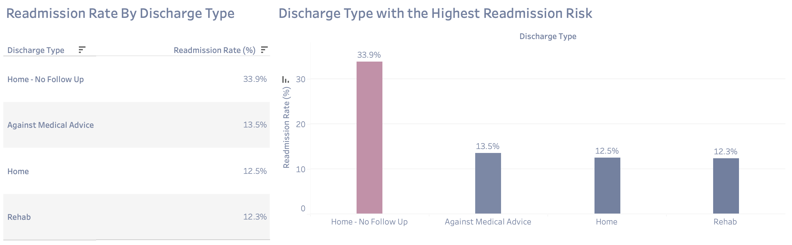
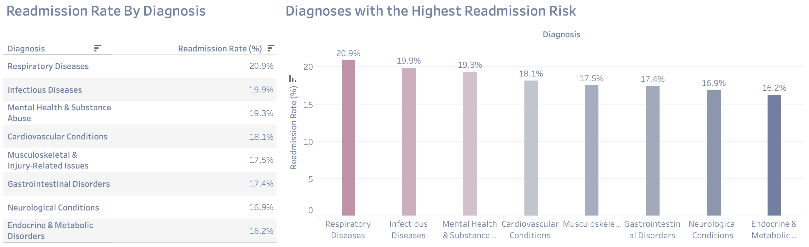

# Silverstone Medical Center Patient Readmission Analysis (End-to-End)

## Overview
Patient readmission rates are costly and can often indicate gaps in patient care and hospital efficiency. This project analyzes readmission trends for Silverstone Medical Center from 2024 to 2025, identifies key contributing factors, and provides data-driven business recommendations to reduce future readmission rates. The project consists of:

- An ETL pipeline (Python, PostgreSQL) [Pipeline Documentation](ETL%20Pipeline/README.md)
- Data Exploration (SQL) [DB SQL Code](SQL%20Queries/Silverstone%20Queries.sql)
- Visualization (Tableau) [Full Dashboard](https://public.tableau.com/views/SilverstoneMedicalCenterPatientReadmissionsOverview/FullDashboard?:language=en-US&:sid=&:redirect=auth&:display_count=n&:origin=viz_share_link)

## Business Question
What factors contributed to the spike in hospital readmissions in July 2024, and what actionable recommendations can we make to reduce future readmissions?

## NorthStar Metrics
- **Readmission Rate (%)** – The percentage of patients that were readmitted.
- **Length of Stay (Days)** – The average number of days a patient stayed in the hospital.
- **Bed Occupancy (%)** – The percentage of occupied beds at the hospital.

## Summary of Insights
### Readmission Rates Over Time
From our data, we observe a **33% spike** in hospital readmissions from June to July 2024.



Readmission rates increased from **18.1% to 24%** from June to July.

### Average Length of Stay
A deeper analysis reveals a correlation between the **average length of hospital stay** and the **readmission rate**.  



The average length of stay dropped from **5.1 days to 2.1 days** from June to July.  
Shorter hospital stays may have led to **premature discharges**, causing more readmissions.

### Bed Occupancy Percentage
The highest readmission rate (**24%**) occurred during the **peak bed occupancy** for 2024 in July.  



Overcrowding may have led to **rushed discharges**, increasing readmissions.

### Other Findings



Patients discharged **home without follow-up care** were much more likely to be readmitted. 



**Respiratory & Infectious Diseases** have the highest readmission rates (**20.9% & 19.9%**).

## Recommendations and Next Steps
- Implement **stricter discharge criteria** and increase the length of stay for high-risk patients to avoid rushed or premature discharges.
- Investigate the **causes of bed occupancy spikes** and improve bed management policies to ensure stable patients are not staying longer than necessary.
- Review the current **discharge process** and consider implementing more **comprehensive discharge education plans** to ensure patients understand their condition before leaving the hospital.

***

## Technical Details
## The Data Pipeline

This project includes an **ETL pipeline** that automates the extraction, transformation, and loading (ETL) of patient data. The pipeline uses **Python**, **pandas**, **SQLAlchemy**, and **PostgreSQL**.

The full ETL process consists of the following steps:
- **Extract**: Extracts the data from CSV files on a local folder.
- **Transform**: Processes the data, cleans it, and prepares it for loading.
- **Load**: Loads the data into a PostgreSQL database.

For the full pipeline documentation, check out the [Pipeline README](ETL%20Pipeline/README.md)

### Data Exploration & SQL Analysis
Using **SQL**, I analyzed key factors influencing readmissions:
1. **Readmission Rate Over Time**
2. **Length of Stay vs. Readmission Rate**
3. **Readmission Rate vs. Bed Occupancy Percentage**
4. **Discharge Type & Follow-Up Impact**
5. **Diagnosis Type & Readmission Risk**
   
#### Example SQL Query:
```sql
-- Readmission rate over time
select a.admission_month as "Month", 
round(avg(a.readmission_flag::numeric) * 100, 1) as "Readmission Rate (%)" 
from admissions a 
group by a.admission_month 
order by a.admission_month;
```
[DB SQL code](SQL%20Queries/Silverstone%20Queries.sql)

### Interactive Tableau Dashboard
[Click here to view the full dashboard](https://public.tableau.com/views/SilverstoneMedicalCenterPatientReadmissionsOverview/FullDashboard?:language=en-US&:sid=&:redirect=auth&:display_count=n&:origin=viz_share_link)


```python

```
